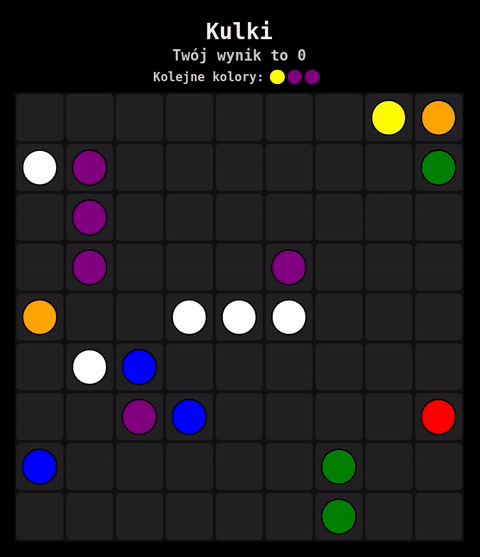

## Kulki webowe

#### Taki tam mały szkolny projekt, chcesz zagrać? [Zapraszam](https://jakubekweg.github.io/kulki/)

Projekt wykonany w języku Typescript bez użycia bibliotek (jedynie webpack to do transpilowania).

Korzystam ze zmiennych cssowych do pozycjonowania, kolorowania i animowania pozycji kulek.

Do znajdowania ścieżki napisałem własną implementację algorytmu A*.

###### Folder dist używany jest przez [GitHub Pages](https://jakubekweg.github.io/kulki/), proszę nie bij za wrzucanie skompilowanego kodu do repo.
